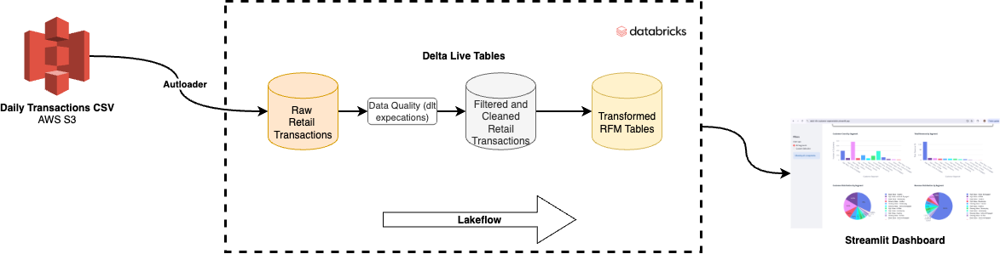
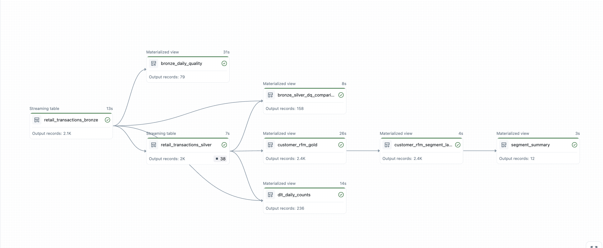
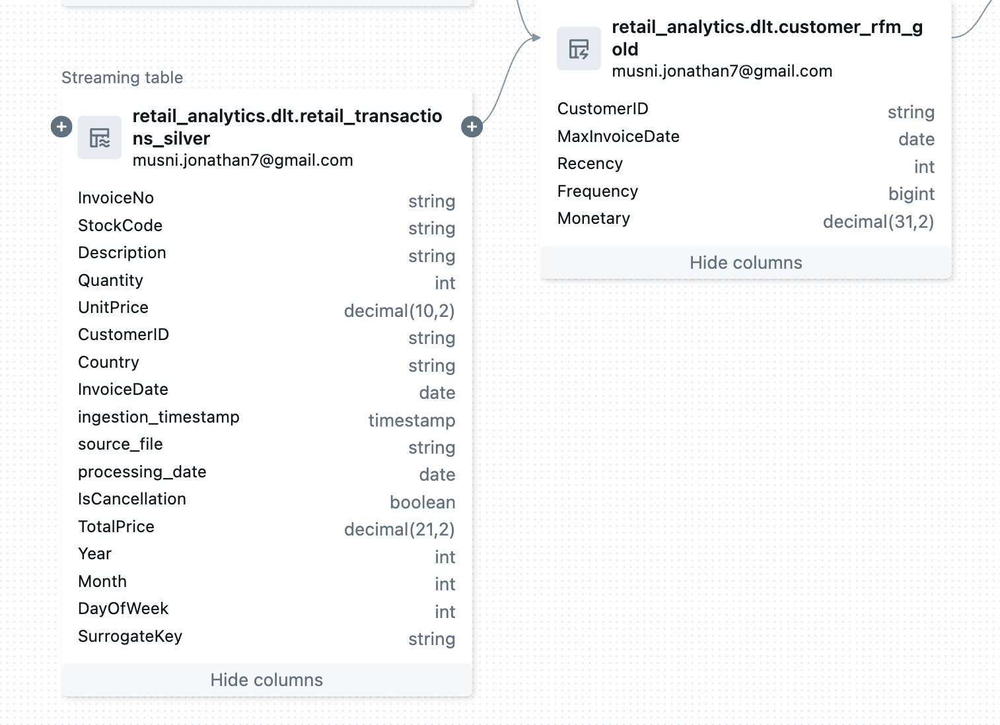

# Retail Transactions to Customer Segments Analytics Pipeline

**By Jonathan Musni** | 💼 [LinkedIn](https://www.linkedin.com/in/musni-jonathan) | 🐙 [GitHub](https://github.com/jemusni07) | 📧 musni.jonathan7@gmail.com

## Objective of the Project
- Group customers into distinct segments based on their shared characteristics and behavior to enable targeted marketing campaigns, optimize resource allocation and improve customer retention.

## Recency Frequency and Monetary(RFM) Metrics
The data pipeline models every transactions made everyday into customer segments based on their Recency Frequency and Monetary(RFM) behavior:

 - **Recency**: How many days since the customer last bought from the website - this metric may indicate potential more engagement through promotions or discount.
 - **Frequency**: How often a customer make a purchase - this measures loyalty - and these customers can be targeted with loyalty programs
 - **Monetary Value**: How much a customer spends - measures profitability and customer value

Based on these metrics, the Marketing team can model recommendations for each customer segments. For example, high and frequent spenders should be rewarded with VIP treatment. Low frequent, low monetary value customer should be reached out with re-engagement initiatives. Combining these three metrics creates a way for the marketing team to create targeted campaigns and promotions. 

## Customer Segmentation Heuristics

This model creates 12 customer segments by combining **Value Tier** (based on spending) with **Engagement Status** (based on recency and frequency).

### Segmentation Logic

| Dimension | Levels | Criteria |
|-----------|--------|----------|
| **Value Tier** | High Value | Monetary > 2× overall median |
| | Growing Value | Monetary > overall median |
| | Base Value | Monetary ≤ overall median |
| **Engagement Status** | Active & Engaged | Recent purchase + High frequency |
| | At Risk | Not recent + High frequency |
| | Developing | Recent purchase + Lower frequency |
| | Inactive | Not recent + Lower frequency |

### Segment Matrix & Recommendations

| Value Tier | Engagement Status | Strategy | Action |
|------------|------------------|----------|--------|
| **High Value** | Active & Engaged | VIP Retention | Loyalty rewards, exclusive access, personalized service |
| **High Value** | At Risk | Urgent Win-back | Personal outreach, premium incentives, feedback collection |
| **High Value** | Developing | Frequency Building | Subscription offers, engagement campaigns, upsell opportunities |
| **High Value** | Inactive | High-touch Reactivation | Direct outreach, special offers, re-engagement incentives |
| **Growing Value** | Active & Engaged | Tier Upgrade | Cross-sell campaigns, loyalty programs, value expansion |
| **Growing Value** | At Risk | Targeted Retention | Personalized offers, loyalty appeals, habit rebuilding |
| **Growing Value** | Developing | Engagement Nurturing | Educational content, onboarding optimization, trial offers |
| **Growing Value** | Inactive | Standard Reactivation | Email campaigns, modest incentives, feedback surveys |
| **Base Value** | Active & Engaged | Value Expansion | AOV increase through bundles, category cross-sells, upsells |
| **Base Value** | At Risk | Light-touch Re-engagement | Automated reminders, small incentives, habit triggers |
| **Base Value** | Developing | New Customer Onboarding | Welcome series, product education, first-purchase incentives |
| **Base Value** | Inactive | Minimal Investment | Automated surveys, low-cost reactivation, list maintenance |

## Data Engineering the RFM pipeline

Now to get to the Machine Learning and customer segmentation. We have to bridge transactions that we are getting into an Customer RFM table clusters. The role of the data team is to understand how these metrics can be modeled out of transactions data that may come in streams or batch to the data hub. We also have to consider other areas of data engineering.

*Data Architecture with the lifecycle of the data from raw to business intelligence layer following the Medallion Architecture.*

On top of ETL and Data Modeling, we have to make sure that the data that we are providing to the downstream stakeholders have gone through proper data engineering lifecycle that includes data quality check, orchestration and governance. In this manner we will be confident that the RFM table we will be creating has full the integrity we need for it to be deployed and used by the marketing team. We will lay out each pieces on how we get to that point.

## Data Source

For a portfolio project, it is nearly impossible to get live retail transaction dataset from retailers. In order to simulate a daily RFM Customer Segmentation with K Means Clustering, the data was source fomr archive and was split into a daily csv, adjusted the transaction dates so that the pipeline will have a "new" transactions to work out everyday until 2026. This will allow us to observe and simulate how customer segments change over time.

- **Dataset**: [Online Retail II - UCI ML Repository](https://archive.ics.uci.edu/dataset/502/online+retail+ii)
- **Description**: UK-based online retail transactions (2009-2011) for unique gift-ware
- **Customer Base**: Primarily wholesalers
- **Transformation**: Historical data split into daily files with shifted dates (2025-2026)

## Data Ingestion Strategy

In order to simulate an ingestion of daily transaction that would normally come from an ECommerce OLTP database, we utilize Github Action to send files in AWS S3 on a specific time daily. 

The S3 prefix where all of the daily csvs are stored is mounted in Databricks ingestion pipeline

- **Approach**: Daily batch processing simulating real-time operations
- **Date Range**: June 26, 2025 → April 24, 2026
- **Automation**: [GitHub Actions for scheduled S3 uploads](https://github.com/jemusni07/daily_uploads)
- **Storage**: AWS S3 bucket prefix (`s3://raw-retail-jmusni/daily_sales/`)

## Data Orchestration with the Medallion Layers

Medallion Architecture with bronze, silver and gold layers serves as our guide in to creating an RFM table that has gone through proper data quality check, enrichment and transformation. With these layers, it is also easy to logically organized our tables from raw data to analytic tables.

DLT(Delta Live Tables) is used for processing the data with its declarative framework wherein we define the data transformations in SQL and Python and DLT automatically manages the infrastructure and the flow of data.

Databricks Lakeflow serves as the orchestration to automate the DLT pipeline, the pipeline is triggered on a daily basis.

*Table Lineage from bronze transactions to segment summary. Two Streaming tables, 3 materialized views, 3 data quality tracking tables.*

### 🥉 Bronze Layer - Raw Data Ingestion
- **File**: `dlt_scripts/01_bronze_layer.py`
- **Purpose**: Raw data landing zone with full fidelity
- **Features**: CloudFiles streaming, metadata capture, basic filtering
- **Schema**: Original CSV structure + pipeline metadata

### 🥈 Silver Layer - Cleaned & Validated Data  
- **File**: `dlt_scripts/02_silver_layer.py`
- **Purpose**: Clean, validated, and enriched data for analytics
- **Features**: Data quality expectations, type casting, feature engineering
- **Transformations**: Cancellation flags, total price calculations, date parsing

### 🥇 Gold Layer - Business-Ready Analytics
- **File**: `dlt_scripts/05_customer_rfm_gold.sql`
- **Purpose**: Aggregated metrics for business intelligence
- **Features**: RFM calculation, customer-level aggregations
- **Output**: Customer behavioral metrics ready for ML

## Data Quality & Monitoring

In the bronze layer, raw unfiltered data is expected, while in silver layer we start curating the data and filtering out records that does not meet  the data quality rules. Finally, all of the gold tables should expect clean data from the silver tables as the only thing they need is to apply business rules. In our gold RFM table, we filtered out cancelled orders so that we do not include those transactions as part of a customers RFM scores

### Quality Expectations (Silver Layer)
- **valid_invoice_no**: Invoice length 6-7 characters, not null
- **valid_stock_code**: Stock code must be present
- **valid_quantity**: Quantity > 0 and not null
- **valid_unit_price**: Unit price >= 0
- **valid_invoice_date**: Valid date format required

### Data Filters & Validation (Gold Layer)

These are the business rules that were allowed to be used in building the RFM table. 

- Excludes cancellation transactions (Invoice starting with 'C')
- Stock code pattern validation (5-digit codes or 'PADS')
- Customer ID must be present for RFM analysis
- Removes invalid or negative quantities/prices

### Quality Monitoring Scripts

As part of the pipeline, three tables were created to observe data quality of the data pipeline. One table checks for comparison with the records between bronze(raw data) and silver(cleaned data) layers

- **Bronze DQ**: `dlt_scripts/01_bronze_dq.sql` - Data quality tracking at ingestion
- **Daily Counts**: `dlt_scripts/04_dlt_daily_counts.sql` - Daily processing metrics
- **Bronze-Silver Comparison**: `dlt_scripts/02_bronze_silver_dq_comparison.sql` - Data validation between bronze and silver layers

## Building the RFM Table

From the silver layer transactions table, we transformed the data in an RFM table that will be used by the K Means Clustering pipeline. Each record will include the following
  
- Identifier
    - CustomerID: Customer identifier   
- RFM Aggregates
    - Recency: Days since the last purchase
    - Frequency: Distinct number of invoices
    - Monetary: sum of all the transactions
- Misc.
    - MaxInvoiceDate: the date of the last transaction/invoice recorded

*Retail Transactions to Silver Layer Transformation*

## Dashboard Link

The dashboard is hosted on Streamlit and can be accessed [here](https://retail-rfm-customer-segmentation.streamlit.app/).

## Summary

Customer segmentation with K Means Clustering is a powerful tool that is applicable to many fields such as retail, finance and other areas that has customer and transactions. With the right data engineering pipeline and modelling, marketing team will be able to efficiently create the right promotion for each demographic/customer segments. 

With right ingestion strategy, proper data quality and orchestration, customer segmentation will be a task worth undertaking for retail analytics.
