# End-to-End Data Engineering Pipeline: Retail Customer Analytics

A comprehensive data engineering project demonstrating the complete data lifecycle from raw data ingestion to machine learning application deployment. This project implements customer segmentation using RFM analysis and K-means clustering for retail transaction data.

## Project Overview

This data engineering project showcases a full-stack implementation covering:

- **Data Ingestion Layer**: Automated daily batch processing from S3
- **Data Processing Layer**: Multi-layered ETL pipeline using Delta Live Tables  
- **Data Storage Layer**: Delta Lake with medallion architecture (Bronze/Silver/Gold)
- **Analytics Layer**: RFM customer segmentation and behavioral analysis
- **Application Layer**: Machine learning clustering with materialized results
- **Monitoring Layer**: Comprehensive data quality and pipeline observability

## Data Architecture

```mermaid
graph TD
    subgraph "Data Preparation"
        UCI[UCI Repository<br/>Historical CSV Dataset<br/>2009-2011]
        SPLIT[Manual Process<br/>Data Splitting<br/>Date Shifting to 2025-2026]
    end
    
    subgraph "Source Control"
        GITHUB[GitHub Repo<br/>Daily CSV Split Files]
    end
    
    subgraph "Automation"
        ACTIONS[GitHub Actions<br/>CRON Trigger<br/>Daily Upload]
        S3[AWS S3 Bucket<br/>/daily_sales/<br/>CSV Files]
    end
    
    subgraph "Ingestion Pipeline"
        DLT[Delta Live Tables<br/>Daily Triggered<br/>CloudFiles Streaming]
    end
    
    subgraph "Medallion Architecture"
        BRONZE[🥉 Bronze Layer<br/>Raw Ingestion + Metadata]
        SILVER[🥈 Silver Layer<br/>Cleaned & Validated Data]
        GOLD[🥇 Gold Layer<br/>RFM Aggregated Metrics]
    end
    
    subgraph "Application Layer"
        ML[ML Pipeline<br/>K-means Clustering]
        SEGMENTS[Customer Segments<br/>Materialized Table]
        DASHBOARD[Databricks Dashboard<br/>Visual Analytics]
    end
    
    subgraph "Monitoring & Quality"
        DQ[Data Quality<br/>Expectations]
        MONITOR[Pipeline Monitoring]
        LINEAGE[Data Lineage Tracking]
    end
    
    UCI --> SPLIT
    SPLIT --> GITHUB
    GITHUB --> ACTIONS
    ACTIONS --> S3
    S3 --> DLT
    DLT --> BRONZE
    BRONZE --> SILVER
    SILVER --> GOLD
    GOLD --> ML
    ML --> SEGMENTS
    SEGMENTS --> DASHBOARD
    
    BRONZE --> DQ
    SILVER --> DQ
    GOLD --> DQ
    DLT --> MONITOR
    DLT --> LINEAGE
    
    style UCI fill:#e1f5fe
    style SEGMENTS fill:#f3e5f5
    style DASHBOARD fill:#e8f5e8
    style BRONZE fill:#ffd54f
    style SILVER fill:#e0e0e0
    style GOLD fill:#ffd700
```


<details>
<summary>Click to view Mermaid source code</summary>


</details>

## Pipeline Layers

### 🥉 Bronze Layer - Raw Data Ingestion
- **File**: `dlt_scripts/01_bronze_layer.py`
- **Purpose**: Raw data landing zone with full fidelity
- **Features**: CloudFiles streaming, metadata capture, basic filtering
- **Schema**: Original CSV structure + pipeline metadata

### 🥈 Silver Layer - Cleaned & Validated Data  
- **File**: `dlt_scripts/02_silver_layer.py`
- **Purpose**: Clean, validated, and enriched data for analytics
- **Features**: Data quality expectations, type casting, feature engineering
- **Transformations**: Cancellation flags, total price calculations, date parsing

### 🥇 Gold Layer - Business-Ready Analytics
- **File**: `dlt_scripts/05_customer_rfm_gold.sql`
- **Purpose**: Aggregated metrics for business intelligence
- **Features**: RFM calculation, customer-level aggregations
- **Output**: Customer behavioral metrics ready for ML

### 🧠 Application Layer - Machine Learning
- **File**: `customer_segmentation_kmeans_clustering/RFM data clustering.ipynb`
- **Purpose**: Customer segmentation using unsupervised learning
- **Features**: K-means clustering, segment analysis, model persistence
- **Output**: Materialized customer segments for business applications

## Data Quality Monitoring

- **Bronze DQ**: `dlt_scripts/01_bronze_dq.sql` - Data quality tracking at ingestion
- **Daily Counts**: `dlt_scripts/04_dlt_daily_counts.sql` - Daily processing metrics
- **Bronze-Silver Comparison**: `dlt_scripts/02_bronze_silver_dq_comparison.sql` - Data validation between layers

## Repository Structure

```
├── README.md                           # Project documentation
├── UPDATES.md                          # Project timeline and updates
├── dlt_scripts/                        # Delta Live Tables pipeline scripts
│   ├── 01_bronze_layer.py             # Raw data ingestion
│   ├── 01_bronze_dq.sql               # Bronze layer data quality
│   ├── 02_silver_layer.py             # Data cleaning and validation
│   ├── 02_bronze_silver_dq_comparison.sql # Layer comparison
│   ├── 03_gold_layer.py               # Business analytics (commented)
│   ├── 04_dlt_daily_counts.sql        # Daily processing metrics
│   └── 05_customer_rfm_gold.sql       # RFM analysis table
├── customer_segmentation_kmeans_clustering/
│   └── RFM data clustering.ipynb       # Customer segmentation notebook
└── images/                             # Pipeline evolution screenshots
    ├── 06_30_2025.png                 # Bronze layer implementation
    ├── 07_01_2025.png                 # Silver layer addition
    └── 07_02_2025.png                 # Gold layer RFM implementation
```

## Data Source

- **Dataset**: [Online Retail II - UCI ML Repository](https://archive.ics.uci.edu/dataset/502/online+retail+ii)
- **Description**: UK-based online retail transactions (2009-2011) for unique gift-ware
- **Customer Base**: Primarily wholesalers
- **Transformation**: Historical data split into daily files with shifted dates (2025-2026)

## Data Ingestion Strategy

- **Approach**: Daily batch processing simulating real-time operations
- **Date Range**: June 26, 2025 → April 24, 2026
- **Automation**: [GitHub Actions for scheduled S3 uploads](https://github.com/jemusni07/daily_uploads)
- **Storage**: AWS S3 bucket (`s3://raw-retail-jmusni/daily_sales/`)

## Technology Stack

- **Data Platform**: Databricks
- **Orchestration**: Databricks Workflows
- **Storage**: AWS S3 (raw files), Delta Lake (processed data)
- **Pipeline Framework**: Delta Live Tables (DLT)
- **Analytics**: Databricks Notebooks & Dashboards
- **Machine Learning**: scikit-learn (K-means clustering)
- **Automation**: GitHub Actions

## Key Features

- **Real-time Processing**: Streaming data ingestion with cloudFiles
- **Data Quality**: Comprehensive validation and expectation handling
- **Customer Analytics**: RFM analysis and behavioral segmentation
- **Monitoring**: Multi-layer data quality tracking
- **Scalability**: Delta Lake optimization and auto-compaction
- **Production Ready**: Materialized views and optimized storage

## Data Lineage


<details>
<summary>Click to view Mermaid source code</summary>


</details>

## Data Contract

### Bronze Layer Schema
```sql
-- retail_transactions_bronze
Invoice: STRING          -- Invoice number
StockCode: STRING        -- Product code
Description: STRING      -- Product description  
Quantity: INTEGER        -- Quantity purchased
Price: DECIMAL(10,2)     -- Unit price
CustomerID: STRING       -- Customer identifier
Country: STRING          -- Customer country
InvoiceDate: STRING      -- Transaction date (raw)
ingestion_timestamp: TIMESTAMP -- Pipeline processing time
source_file: STRING      -- Source file path
processing_date: DATE    -- Processing date
```

### Silver Layer Schema
```sql
-- retail_transactions_silver
InvoiceNo: STRING        -- Cleaned invoice number
StockCode: STRING        -- Product code
Description: STRING      -- Product description
Quantity: INTEGER        -- Quantity (>0)
UnitPrice: DECIMAL(10,2) -- Unit price (>=0)
CustomerID: STRING       -- Customer ID (not null)
Country: STRING          -- Customer country
InvoiceDate: DATE        -- Parsed date
IsCancellation: BOOLEAN  -- Cancellation flag
TotalPrice: DECIMAL      -- Calculated total
Year/Month/DayOfWeek: INT -- Date components
SurrogateKey: STRING     -- Unique identifier
```

### Gold Layer Schema
```sql
-- customer_rfm_gold
CustomerID: STRING       -- Customer identifier
MaxInvoiceDate: DATE     -- Last purchase date
Recency: INTEGER         -- Days since last purchase
Frequency: INTEGER       -- Number of transactions
Monetary: DECIMAL        -- Total spend amount
```

## Data Quality

### Quality Expectations (Silver Layer)
- **valid_invoice_no**: Invoice length 6-7 characters, not null
- **valid_stock_code**: Stock code must be present
- **valid_quantity**: Quantity > 0 and not null
- **valid_unit_price**: Unit price >= 0
- **valid_invoice_date**: Valid date format required

### Quality Monitoring Tables
- **bronze_dq**: Tracks data quality metrics at ingestion
- **dlt_daily_counts**: Daily processing volume monitoring
- **bronze_silver_dq_comparison**: Validates data integrity between layers

### Data Filters
- Excludes cancellation transactions (Invoice starting with 'C')
- Stock code pattern validation (5-digit codes or 'PADS')
- Customer ID must be present for RFM analysis
- Removes invalid or negative quantities/prices

## Disclaimer

This project is inspired by [TrentDoesMath's YouTube tutorial](https://www.youtube.com/watch?v=afPJeQuVeuY&t=2587s). The main enhancement is operationalizing the analysis for production use with continuous data updates and automated clustering pipeline.
