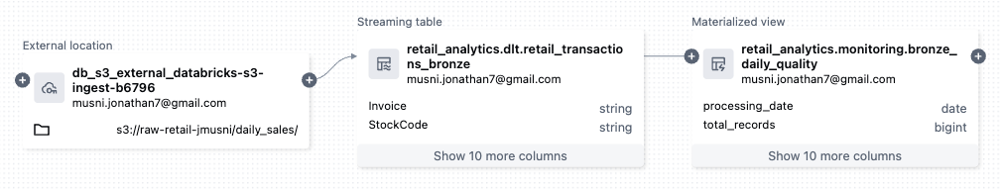
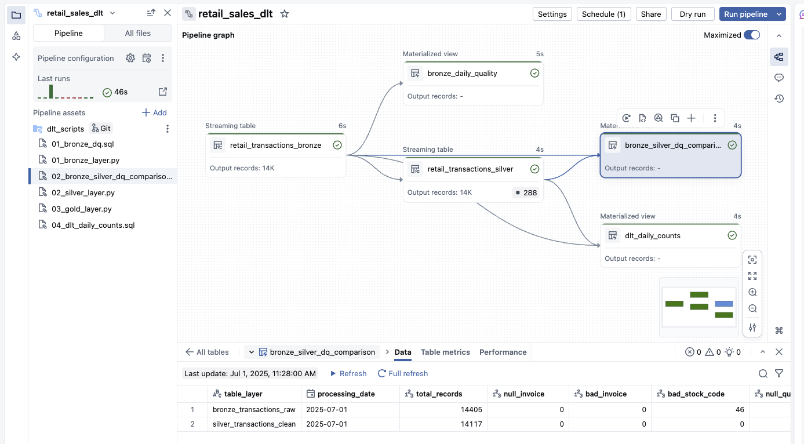
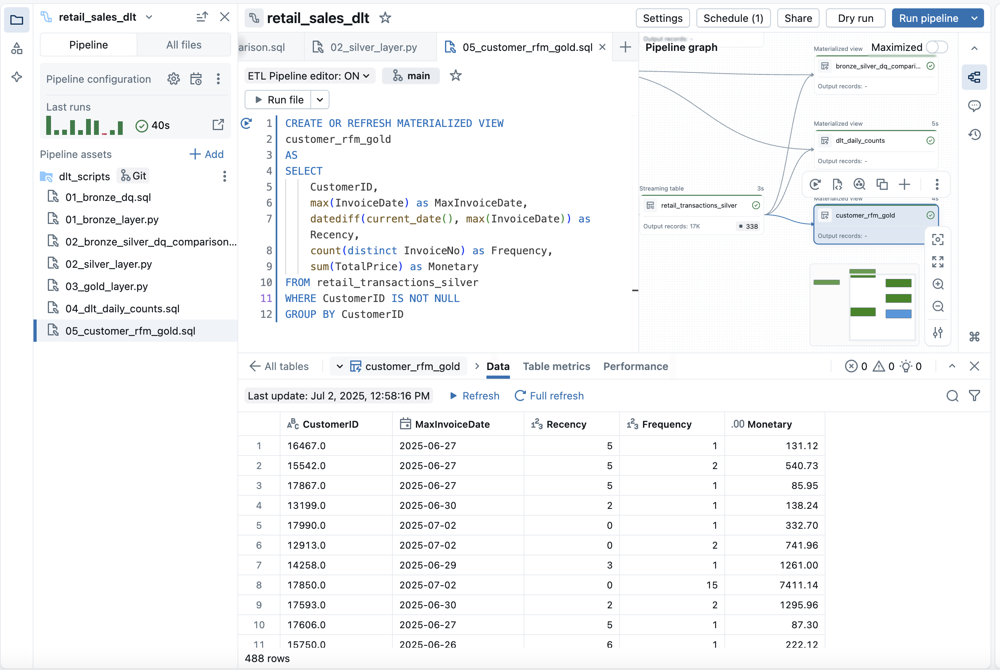

# Updates for the project

**[06-30-2025]** - Bronze layer and data quality monitoring tables created and now in the workflow 
    

**[07-01-2025]** - Added the clean silver layer to the workflow, added two data quality monitoring tables - dlt_dailly_counts and bronze_silver_dq_comparison
    

**[07-02-2025]** - Added customer RFM gold table to the dlt pipeline/workflow
    

**[07-03-2025]** - Added notebook for Customer RFM Segmentation EDA and K Means Clustering
   -  [Notebook](eda_kmeans_clustering/RFM data clustering.ipynb)